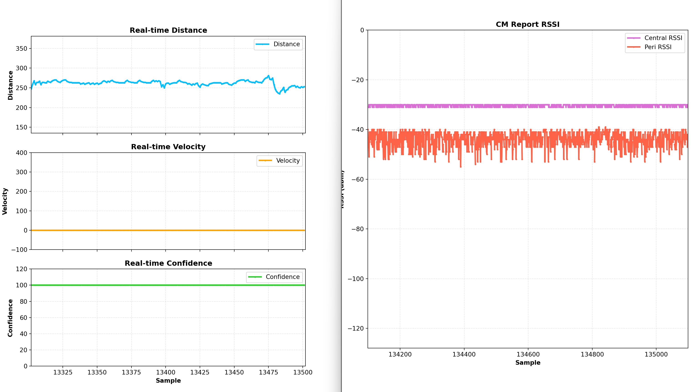

# CS_CM_Uart_Demo Readme

# 硬件

1. 3x LP-EM-CC2745R10-Q1 Launchpad

# 软件环境

1. Code Composer Studio 集成开发环境
2. SimpleLink Low Power F3 SDK (9.20.01.21) or Above
3. Python(可选)

# 步骤

1. 编译`car_node_CC2745R10_CS_EVM_CS_CM`工程，并烧录到其中的两个CC2745 Launchpad作为CM_CS节点
2. 将这两个CC2745的板子按下方进行GPIO连接。
   |CC2745-Launchpad 1|CC2745 Launchpad 2|
   |--|--|
   |DIO3|DIO4|
   |DIO4|DIO3|
   |GND|GND|
3. 编译`key_node_CC2745_920`并烧录到第三块CC2745 Launchpad.
4. 两个CM_CS节点会自动搜索“`Key Node”`广播并进行连接，并且只有一个会连接上，另外一个自动作为Connection Monitor 的节点。
5. 使用串口工具观察结果，波特率为`921600`。
6. （可选）修改CM_CS_Uart_Plot.py中的COM号，关闭其他的串口调试助手，运行python即可画出下方的图。
   
   

# 注意

1. #### Velocity还正在调试，当前还不可用。
2. Channel Sounding的参数默认使用1x1的天线，可以在car node里面进行调整，参考channel sounding demo目录下的readme。
3. Channel Sounding Distance的精度还在进一步优化。
