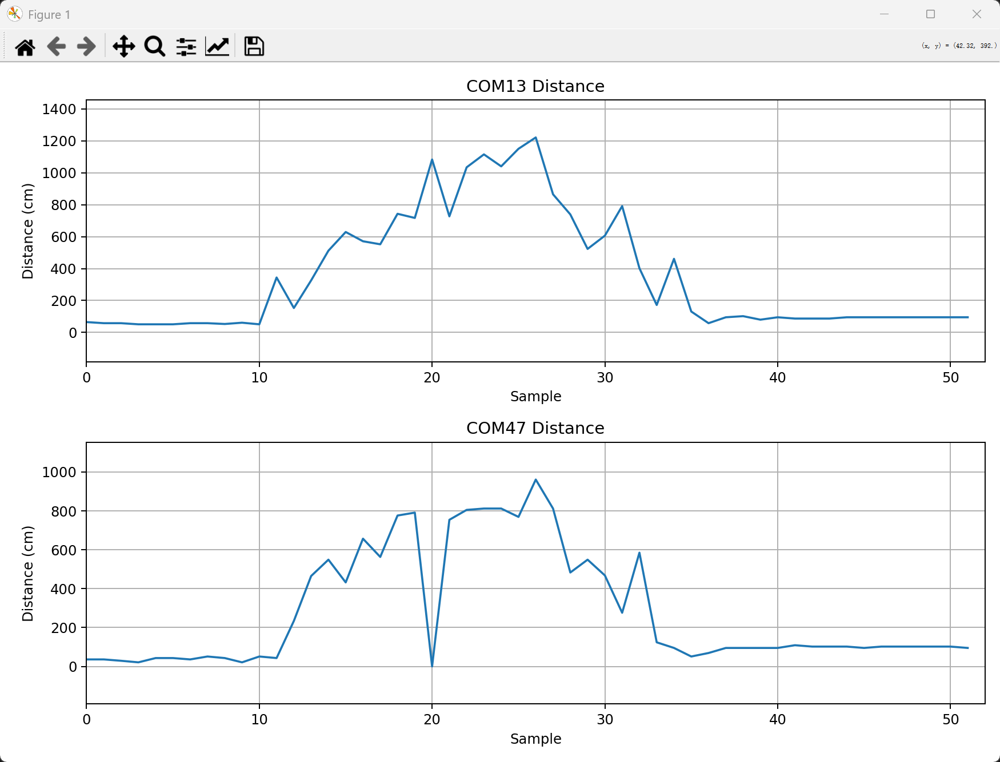
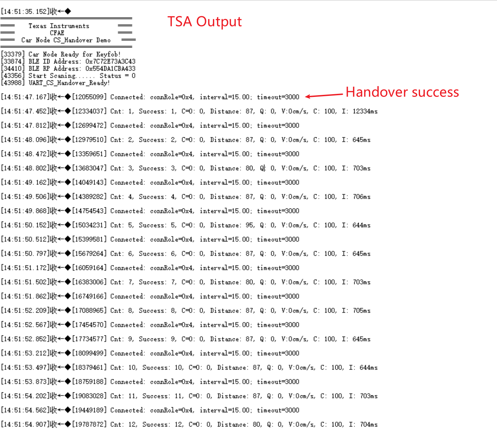
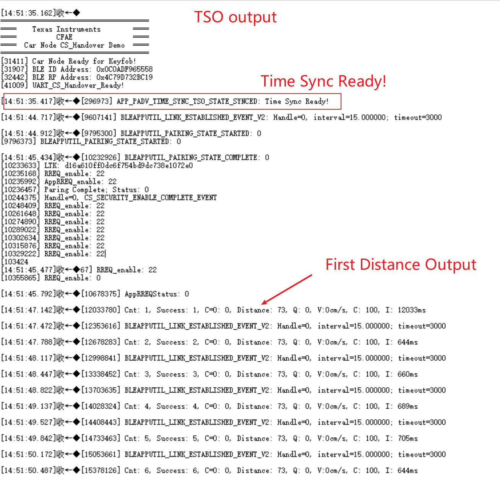

# CS_Handover_Uart_Demo Readme

# 简介

本Demo演示Channel Sounding在TSA（Time Sync Advertiser）与TSO（Time Sync Observer）之间的Handover（切换）机制。两个Car Node节点（TSA与TSO）通过PA（Periodic Advertising，周期广播）进行时间同步并同时广播，Key Node节点会自动搜索并连接其中一个，然后开始CS Handover的功能演示。

# 硬件

1. 3x LP-EM-CC2745R10-Q1 Launchpad

# 软件环境

1. Code Composer Studio 集成开发环境
2. SimpleLink Low Power F3 SDK (9.20.01.21) or Above
3. Python(可选)

# 步骤

1. 编译`car_node_CC2745R10_CS_Handover_TSA`工程，并烧录到其中的一个CC2745 Launchpad作为CS_Handover_TSA节点（TSA，Time Sync Advertiser）。
2. 编译`car_node_CC2745R10_CS_Handover_TSO`工程，并烧录到其中的一个CC2745 Launchpad作为CS_Handover_TSO节点（TSO，Time Sync Observer）。
3. 将这两个CC2745的板子按下方进行GPIO连接。
   |CC2745 Launchpad 1|CC2745 Launchpad 2|
   |--|--|
   |DIO3|DIO4|
   |DIO4|DIO3|
   |GND|GND|
4. 编译`key_node_CC2745_920_0121_central`并烧录到第三块CC2745 Launchpad作为Key Node节点。
5. Key Node节点会自动搜索`Car Node`广播（TSA和TSO节点都会进行广播）并进行连接。两个节点中只有一个会被连接上。
6. 使用串口工具观察结果，波特率为`921600`。
7. （可选）修改CS_handover_demo.py中的两个COM号，关闭其他的串口调试助手，运行python即可画出下方的图。
   
8. 如果使用串口工具进行观察的话，TSA和TSO的正确输出分别如下。

# 注意
1. Velocity正值代表Key Node远离Car Node，负值则为靠近。
2. Channel Sounding的参数默认使用1x1的天线，可以在car node里面进行调整，参考`Channel_Sounding_Demo`目录下的README。
3. Channel Sounding Distance的精度还在进一步优化。
