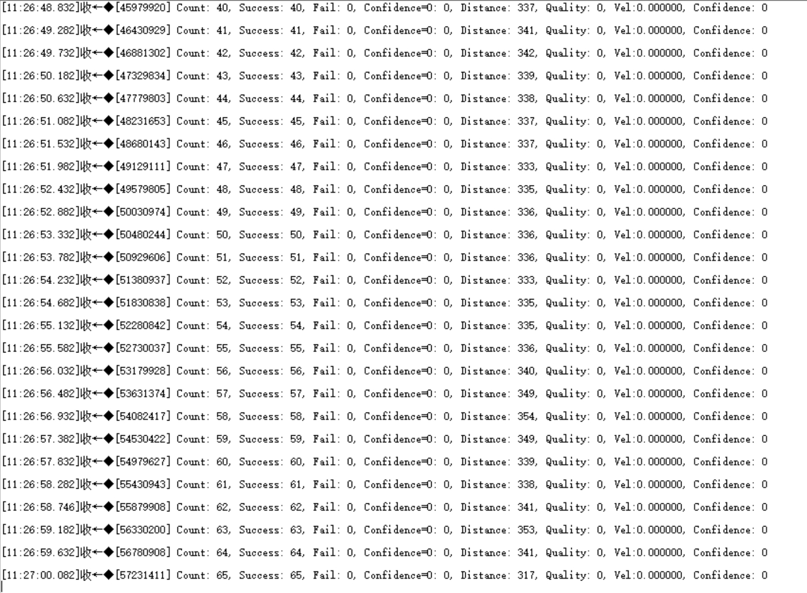

# Channel Sounding Demo with Phone

# 硬件

1. 1x LP-EM-CC2745R10-Q1 Launchpad
2. 荣耀 Magic 8系列 或其他支持Channel Sounding的手机

# 软件环境

1. Code Composer Studio 集成开发环境
2. SimpleLink Low Power F3 SDK (9.20.00.81) or Above

# 步骤

1. 进入car_node_CC2745_920工程，找到app_car_node.c，把`xPHONE`改成`PHONE`
2. 编译并烧录程序。
3. 使用手机蓝牙调试助手连接“Car Node”
4. 使用串口工具观察结果

# 结果

使用串口工具，打开CC2745对应的串口，波特率为921600.

会看到下方结果

